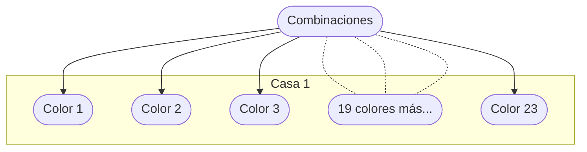
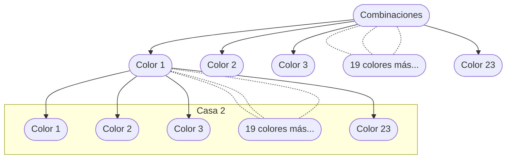

##### 1.a. Se deben pintar los frentes de 10 casas y se dispone de 23 colores distintos de pintura. ¿De cuántas formas puede hacerse? ¿De cuántas formas puede hacer si cada casa debe tener un color distinto?

Tenemos 10 casas y 23 colores disponibles. Por lo tanto, por cada casa tenemos 23 opciones. Si sólo tuvieramos que pintar una, la respuesta sería trivial. Hay 23 maneras de pintar una casa.



Supongamos que para alguna de las casas elegimos (o "fijamos") el $Color$ $1$. Luego pasaríamos a la siguiente casa y tendriamos que elegir nuevamente otro color de los 23 disponibles:



Este proceso de elegir alguno de los 23 colores para la segunda casa lo deberíamos repetir para los otros 22 colores posibles para la primer casa:

```mermaid
flowchart TD
    combinations([Combinaciones])
    color1([Color 1])

    2acolor1([Color 1])
    2acolor2([Color 2])
    2acolor3([Color 3])
    2aetc([19 colores más...])
    2acolor23([Color 23])

    color2([Color 2])

    2bcolor1([Color 1])
    2bcolor2([Color 2])
    2bcolor3([Color 3])
    2betc([19 colores más...])
    2bcolor23([Color 23])

    color3([Color 3])

    2ccolor1([Color 1])
    2ccolor2([Color 2])
    2ccolor3([Color 3])
    2cetc([19 colores más...])
    2ccolor23([Color 23])

    etc([19 colores más...])
    color23([Color 23])

    2dcolor1([Color 1])
    2dcolor2([Color 2])
    2dcolor3([Color 3])
    2detc([19 colores más...])
    2dcolor23([Color 23])

    combinations --> color1
    combinations --> color2
    combinations --> color3
    combinations -.- etc
    combinations -.- etc
    combinations -.- etc
    combinations --> color23

    color1 --> 2acolor1
    color1 --> 2acolor2
    color1 --> 2acolor3
    color1 -.- 2aetc
    color1 -.- 2aetc
    color1 -.- 2aetc
    color1 --> 2acolor23

    color2 --> 2bcolor1
    color2 --> 2bcolor2
    color2 --> 2bcolor3
    color2 -.- 2betc
    color2 -.- 2betc
    color2 -.- 2betc
    color2 --> 2bcolor23

    color3 --> 2ccolor1
    color3 --> 2ccolor2
    color3 --> 2ccolor3
    color3 -.- 2cetc
    color3 -.- 2cetc
    color3 -.- 2cetc
    color3 --> 2ccolor23

    color23 --> 2dcolor1
    color23 --> 2dcolor2
    color23 --> 2dcolor3
    color23 -.- 2detc
    color23 -.- 2detc
    color23 -.- 2detc
    color23 --> 2dcolor23
```



Es decir que para 2 casas y 23 colores, obtendríamos $23 + 23 + 23 + ... + 23 = 23 \times 23 = 23^{2}$ .

El patrón a seguir es el siguiente:

| Casas         | 1        | 2        | 3        | 4        | 5        | 6        | 7        | 8        | 9        | 10        |
| ---           | ---      | ---      | ---      | ---      | ---      | ---      | ---      | ---      | ---      | ---       |
| Posibilidades | $23^{1}$ | $23^{2}$ | $23^{3}$ | $23^{4}$ | $23^{5}$ | $23^{6}$ | $23^{7}$ | $23^{8}$ | $23^{9}$ | $23^{10}$ |

```math
\text{El resultado es } 23^{10} {}_\square
```

Ahora bien, entre dichos resultados estamos contando situaciones donde hay casas con colores repetidos. Por ejemplo situaciones como la siguiente:

| Casa   | 1        | 2        | 3        | 4        | 5        | 6        | 7        | 8        | 9        | 10       |
| ---    | ---      | ---      | ---      | ---      | ---      | ---      | ---      | ---      | ---      | ---      |
| Caso A | Color 1  | Color 1  | Color 2  | Color 2  | Color 3  | Color 3  | Color 4  | Color 4  | Color 5  | Color 5  |
| Caso B | Color 1  | Color 1  | Color 1  | Color 1  | Color 1  | Color 1  | Color 1  | Color 1  | Color 1  | Color 1  |

Por lo tanto, si agregamos la restricción de no repetir los colores, obtendríamos un patrón similar al siguiente (restringido a 4 colores y 3 casas, por simplicidad):

```mermaid
flowchart TD
    combinations([Combinaciones])

    casa1_color1_A([Color 1])

        casa2_color2_A([Color 2])

            casa3_color3_B([Color 3])
            casa3_color4_B([Color 4])

        casa2_color3_A([Color 3])

            casa3_color2_C([Color 2])
            casa3_color4_C([Color 4])

        casa2_color4_A([Color 4])

            casa3_color2_D([Color 2])
            casa3_color3_D([Color 3])

    casa1_color2_A([Color 2])

        casa2_color1_B([Color 1])

            casa3_color3_E([Color 3])
            casa3_color4_E([Color 4])

        casa2_color3_B([Color 3])

            casa3_color1_F([Color 1])
            casa3_color4_F([Color 4])

        casa2_color4_B([Color 4])

            casa3_color1_G([Color 1])
            casa3_color3_G([Color 3])


    casa1_color3_A([Color 3])

        casa2_color1_C([Color 1])

            casa3_color2_H([Color 2])
            casa3_color4_H([Color 4])

        casa2_color2_C([Color 2])

            casa3_color1_I([Color 1])
            casa3_color4_I([Color 4])

        casa2_color4_C([Color 4])

            casa3_color1_J([Color 1])
            casa3_color2_J([Color 2])


    casa1_color4_A([Color 4])

        casa2_color1_D([Color 1])

            casa3_color2_K([Color 2])
            casa3_color3_K([Color 3])

        casa2_color2_D([Color 2])

            casa3_color1_L([Color 1])
            casa3_color3_L([Color 3])

        casa2_color3_D([Color 3])

            casa3_color1_M([Color 1])
            casa3_color2_M([Color 2])

    combinations --> casa1_color1_A
    combinations --> casa1_color2_A
    combinations --> casa1_color3_A
    combinations --> casa1_color4_A

    casa1_color1_A --> casa2_color2_A
    casa1_color1_A --> casa2_color3_A
    casa1_color1_A --> casa2_color4_A

    casa1_color2_A --> casa2_color1_B
    casa1_color2_A --> casa2_color3_B
    casa1_color2_A --> casa2_color4_B

    casa1_color3_A --> casa2_color1_C
    casa1_color3_A --> casa2_color2_C
    casa1_color3_A --> casa2_color4_C

    casa1_color4_A --> casa2_color1_D
    casa1_color4_A --> casa2_color2_D
    casa1_color4_A --> casa2_color3_D

    casa2_color2_A --> casa3_color3_B
    casa2_color2_A --> casa3_color4_B

    casa2_color3_A --> casa3_color2_C
    casa2_color3_A --> casa3_color4_C

    casa2_color4_A --> casa3_color2_D
    casa2_color4_A --> casa3_color3_D

    casa2_color1_B --> casa3_color3_E
    casa2_color1_B --> casa3_color4_E

    casa2_color3_B --> casa3_color1_F
    casa2_color3_B --> casa3_color4_F

    casa2_color4_B --> casa3_color1_G
    casa2_color4_B --> casa3_color3_G

    casa2_color1_C --> casa3_color2_H
    casa2_color1_C --> casa3_color4_H

    casa2_color2_C --> casa3_color1_I
    casa2_color2_C --> casa3_color4_I

    casa2_color4_C --> casa3_color1_J
    casa2_color4_C --> casa3_color2_J

    casa2_color1_D --> casa3_color2_K
    casa2_color1_D --> casa3_color3_K

    casa2_color2_D --> casa3_color1_L
    casa2_color2_D --> casa3_color3_L

    casa2_color3_D --> casa3_color1_M
    casa2_color3_D --> casa3_color2_M
```



Como se observa, tenemos 4 opciones para la primer casa. Dentro de cada una de esas opciones, al momento de pintar la segunda casa nos quedan 3 colores disponibles. A su vez, cuando queremos pintar la tercera casa, sea cual sea la situación, siempre nos quedan disponibles sólo 2 colores.

Finalmente, si contamos las hojas del árbol resultante vemos que son 24, y concluimos que esa es la cantidad total de casos donde tenemos 4 colores disponibles, 3 casas a pintar y la restricción que todas sean distintas. La fórmula sigue la siguiente lógica, tomamos como $n$ el número total de opciones disponibles en el paso actual y lo multiplicamos por las opciones que nos quedarían en el paso siguiente, que sería "n-1$. Como en el primer paso tenemos los 4 colores disponibles, comenzamos multiplicando 4 con la cantidad de colores disponibles para la segunda casa, que sería 4-1. Así sucesivamente hasta llegar al último paso, o última casa:

```math
4 \times 3 \times 2 = 24
```

Si aplicamos ésta misma fórmula para nuestro problema original, el de las 10 casas y los 23 colores disponibles, entonces tendríamos el siguiente resultado:

```math
23 \times 22 \times 21 \times 20 \times 19 \times 18 \times 17 \times 16 \times 15 \times 14 = \prod_{n=14}^{23} n = \frac{\prod_{n=1}^{23} n}{\prod_{n=1}^{13} n} = \frac{23!}{13!} _\square
```
