### <a name="4"></a> 4. Una clase tiene 3 estudiantes de Villa Ballester y 4 de Claypole. Se elige de entre ellos un comité de 5 estudiantes. Hallar la cantidad de posibles comités que tienen dos estudiantes de Villa Ballester y tres de Claypole.

Tenemos que elegir 5 estudiantes de 7 en total, pero con una condición muy específica. Supongo que tengo 2 lugares disponibles para estudiantes de Ballester, asi que para el primer lugar tendremos la cantidad total de estudiantes de Ballester disponibles, mientras que para el segundo tendremos una opción menos:

```math
3 \times 2 = 3!
```

De forma análoga para el caso de estudiantes de Claypole:

```math
4 \times 3 \times 2 = 4!
```

Ahora multiplicamos entre sí cada uno de los resultados intermedios para obtener el recuento de comités de 5 personas siguiendo el requisito solicitado:

```math
3! \times 4!
```

El problema es que estamos considerando comités repetidos (porque le estamos dando importancia al orden de incorporación de los integrantes al comité). Por ejemplo, si los 3 estudiantes de Ballester se llamaran Ana, Belén y Carlos:


Los sub-comités de 2 integrantes de Ballester se estarían repitiendo 2 veces cada uno, es decir, tenemos 6 sub-comités posibles, pero 3 de ellos tienen los mismos integrantes. Lo mismo sucede con el sub-comité de Claypole, a quienes llamaremos Daniel, Eze, Fede y Gabi:

```mermaid
flowchart TD
    group([Comités])

    daniel_1a([Daniel])
    eze_1a([Eze])
    fede_1a([Fede])
    gabi_1a([Gabi])

    eze_2a([Eze])
    fede_2a([Fede])
    gabi_2a([Gabi])

    daniel_2b([Daniel])
    fede_2b([Fede])
    gabi_2b([Gabi])

    daniel_2c([Daniel])
    eze_2c([Eze])
    gabi_2c([Gabi])

    daniel_2d([Daniel])
    eze_2d([Eze])
    fede_2d([Fede])

    group --> daniel_1a
    group --> eze_1a
    group --> fede_1a
    group --> gabi_1a

    daniel_1a --> eze_2a
    daniel_1a --> fede_2a
    daniel_1a --> gabi_2a
    eze_1a --> daniel_2b
    eze_1a --> fede_2b
    eze_1a --> gabi_2b
    fede_1a --> daniel_2c
    fede_1a --> eze_2c
    fede_1a --> gabi_2c
    gabi_1a --> daniel_2d
    gabi_1a --> eze_2d
    gabi_1a --> fede_2d

    fede_3a([Fede])
    gabi_3a([Gabi])
    eze_2a --> fede_3a
    eze_2a --> gabi_3a
    eze_3b([Eze])
    gabi_3b([Gabi])
    fede_2a --> eze_3b
    fede_2a --> gabi_3b
    eze_3c([Eze])
    fede_3c([Fede])
    gabi_2a --> eze_3c
    gabi_2a --> fede_3c

    fede_3d([Fede])
    gabi_3d([Gabi])
    daniel_2b --> fede_3d
    daniel_2b --> gabi_3d
    daniel_3e([Daniel])
    gabi_3e([Gabi])
    fede_2b --> daniel_3e
    fede_2b --> gabi_3e
    daniel_3f([Daniel])
    fede_3f([Fede])
    gabi_2b --> daniel_3f
    gabi_2b --> fede_3f

    eze_3g([Eze])
    gabi_3g([Gabi])
    daniel_2c --> eze_3g
    daniel_2c --> gabi_3g
    daniel_3h([Daniel])
    gabi_3h([Gabi])
    eze_2c --> daniel_3h
    eze_2c --> gabi_3h
    daniel_3i([Daniel])
    eze_3i([Eze])
    gabi_2c --> daniel_3i
    gabi_2c --> eze_3i

    eze_3j([Eze])
    fede_3j([Fede])
    daniel_2d --> eze_3j
    daniel_2d --> fede_3j
    daniel_3k([Daniel])
    fede_3k([Fede])
    eze_2d --> daniel_3k
    eze_2d --> fede_3k
    daniel_3l([Daniel])
    eze_3l([Eze])
    fede_2d --> daniel_3l
    fede_2d --> eze_3l
```



Obtenemos 24 hojas en el árbol de decisión, por lo tanto podemos contar 24 sub-comités posibles con integrantes exclusivamente de Claypole. Esto es porque al considerar el orden de elección de cada integrante para un sub-comité de $x$ personas, estamos permutando esos $x$ lugares. Eliminemos las permutaciones de ambas soluciones intermedias y obtendremos el resultado final:

```math
\frac{3!}{2!} \times \frac{4!}{3!} = 3 \times 4 = 12 _\square
```

> [Volver](../README.md)
