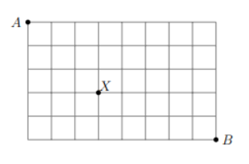

# Probabilidad y Estadística (C)

## Práctica 1

### 1. Preliminares

1.
    1. <a href="1_preliminares/ejercicio_1.md#1.a">Se deben pintar los frentes de 10 casas y se dispone de 23 colores distintos de pintura. ¿De cuántas formas puede hacerse? ¿De cuántas formas puede hacer si cada casa debe tener un color distinto?</a>
    2. <a href="1_preliminares/ejercicio_1.md#1.b">Generalizar el ítem anterior para el caso de $k$ casas y $n$ colores.</a>
2.
    1. [De un grupo de 35 deportistas se necesita elegir 5 para participar de una competición. ¿De cuántas formas distintas puede hacerse? ¿Qué cambia si esos cinco representantes a su vez cumplen cinco funciones distintas?](1_preliminares/ejercicio_2.md#2.a)
    2. [Generalizar el ítem anterior para el caso de $n$ deportistas y $k$ representantes.](1_preliminares/ejercicio_2.md#2.b)
3. [En el tablero de la figura,](1_preliminares/ejercicio_3.md#3)



[¿cuántas formas hay de llegar desde *A* hasta *B* realizando movimientos hacia abajo y hacia la derecha siguiendo las líneas? ¿Cuántos de esos caminos pasan por $X$? Generalizar para un tablero de tamaño $n \times m$.](1_preliminares/ejercicio_3.md#3)

4. [Una clase tiene 3 estudiantes de Villa Ballester y 4 de Claypole. Se elige de entre ellos un comité de 5 estudiantes. Hallar la cantidad de posibles comités que tienen dos estudiantes de Villa Ballester y tres de Claypole.](1_preliminares/ejercicio_4.md#4)
5. [De una caja que contiene 123 bolillas numeradas de 1 a 123 se extraen cinco bolillas. ¿Cuántos resultados posibles hay si](1_preliminares/ejercicio_5.md#5)
    1. [las bolillas se extraen una a la vez y se descartan después de extraerlas?](1_preliminares/ejercicio_5.md#5.a)
    2. [las bolillas se extraen una a la vez y se devuelven a la caja después de extraerlas?](1_preliminares/ejercicio_5.md#5.b)
    3. [las bolillas se extraen todas juntas?](1_preliminares/ejercicio_5.md#5.c)
6.
    1. [¿Cuántos anagramas de **BIBLIOTECARIA** pueden formarse?](1_preliminares/ejercicio_6.md#6.a)
    2. [¿Y con la condición de que la T esté a la derecha de la C?](1_preliminares/ejercicio_6.md#6.b)
    3. [¿Y con la condición de que la T esté a la derecha de la C y la C a la derecha de la R?](1_preliminares/ejercicio_6.md#6.c)
    4. [¿Y con la condición de que las dos A no estén juntas?](1_preliminares/ejercicio_6.md#6.d)
    5. [¿Y con la condición de que todas las vocales estén juntas?](1_preliminares/ejercicio_6.md#6.e)

### 2. Probabilidad en espacios finitos, equiprobabilidad

1. [Se arroja dos veces un dado equilibrado, registrándose los resultados obtenidos.](2_equiprobabilidad/ejercicio_1.md#1)
    1. [Definir un espacio muestral $S$ apropiado para este experimento.](2_equiprobabilidad/ejercicio_1.md#1.a)
    2. [Describir el conjunto de elementos del espacio muestral que satisface que:](2_equiprobabilidad/ejercicio_1.md#1.b)
        - [***$A$***: la suma de los dos números obtenidos es por lo menos 5](2_equiprobabilidad/ejercicio_1.md#1.b.1)
        - [***$B$***: el valor obtenido en el primer tiro es superior al obtenido en el segundo](2_equiprobabilidad/ejercicio_1.md#1.b.2)
        - [***$C$***: el valor obtenido en el primer tiro es un 4](2_equiprobabilidad/ejercicio_1.md#1.b.3)
    3. [Calcular las probabilidades de los eventos definidos en 1.ii.](2_equiprobabilidad/ejercicio_1.md#1.c)
    4. [Simular en **R** el experimento de tirar dos veces un dado equilibrado.](2_equiprobabilidad/ejercicio_1.md#1.d)
    5. [Simular 1000 veces en **R** el experimento de tirar dos veces un dado equilibrado y estimar las probabilidades de los sucesos definidos en 1.b.](2_equiprobabilidad/ejercicio_1.md#1.e)
    6. [Describir los siguientes conjuntos:](2_equiprobabilidad/ejercicio_1.md#1.f)
        1. [$A \cap B$](2_equiprobabilidad/ejercicio_1.md#1.f.1)
        2. [$B \cup C$](2_equiprobabilidad/ejercicio_1.md#1.f.2)
        3. [$A \cap (B \cup C)$](2_equiprobabilidad/ejercicio_1.md#1.f.3)
    7. [Calcular las probabilidades de los sucesos definidos en 1.vi](2_equiprobabilidad/ejercicio_1.md#1.g)
    8. [Estimar las probabilidades de los sucesos definidos en 1.vi mediante simulaciones. Comparar con los resultados obtenidos en 1.vii.](2_equiprobabilidad/ejercicio_1.md#1.h)
2.
    1. [Dados dos eventos $A$ y $B$ tales que se conocen $P(A \cup B)$ y $P(A \cap B)$, hallar una fórmula para la probabilidad de que ocurra exactamente uno de estos eventos.](2_equiprobabilidad/ejercicio_2.md#2.a)
    2. [Una compañía constructora trabaja en dos proyectos diferentes. Sea $A$ el evento: “el primero de los proyectos se termina en la fecha del contrato” y definamos análogamente $B$ para el segundo proyecto. Si $P(A \cup B) = 0.9$ y $P(A \cap B) = 0.5$, ¿cuál es la probabilidad de que exactamente un proyecto se termine para la fecha de contrato?](2_equiprobabilidad/ejercicio_2.md#2.b)
3. [Supongamos que cuando una computadora se “cuelga” (no responde), el 75% de las veces se debe a problemas de memoria y el 15% de las veces a problemas de software y que el 15% de las veces se debe a problemas que no son ni de memoria ni de software. Si una computadora se cuelga,](2_equiprobabilidad/ejercicio_3.md#3)
    1. [¿cuál es la probabilidad de que estos dos problemas ocurran simultáneamente?](2_equiprobabilidad/ejercicio_3.md#3.a)
    2. [¿cuál es la probabilidad de que ocurra un problema de software y no de memoria?](2_equiprobabilidad/ejercicio_3.md#3.b)
4. ***FALTA!!!*** [De un bolillero que contiene 5 bolillas numeradas 1, 2, 3, 4, 5 se extrae una al azar, sea la número $k$. Se eliminan las bolillas cuyo número es mayor que $k$ de la urna y se hace una segunda extracción al azar entre las bolillas 1 a $k$, sea la número $j$. Se eliminan las bolillas cuyo número es mayor que $j$ de la urna y se hace una tercera extracción al azar entre las bolillas 1 a $j$.](2_equiprobabilidad/ejercicio_4.md#4)
    1. [Describir un espacio muestral adecuado para este experimento y determinar el número de elementos que posee.](2_equiprobabilidad/ejercicio_4.md#4.a)
    2. [¿Es razonable suponer equiprobabilidad en este espacio? ¿Qué probabilidad le asignaría al $(3,2,1)$?](2_equiprobabilidad/ejercicio_4.md#4.b)
5. [Una firma proveedora de software ha ofrecido sus servicios a 3 empresas. Se definen los eventos $A_i$ = {la empresa $i$ realiza una compra a esta firma} , para $i = 1, 2, 3$. Se sabe que:](2_equiprobabilidad/ejercicio_5.md#5)

```math
\begin{array}{ccc}
P(A_1)=0.22 & P(A_2)=0.25 & P(A_3)=0.28 \\
P(A_1 \cap A_2)=0.11 & P(A_1 \cap A_3)=0.05 & P(A_2 \cap A_3)=0.07 \\
P(A_1 \cap A_2 \cap A_3)=0.01
\end{array}
```

[Expresar en palabras los siguientes eventos y calcular sus probabilidades:](2_equiprobabilidad/ejercicio_5.md#5)

```math
\begin{array}{ccc}
A_1 \cup A_2 & A^C_1 \cap A^C_2 & A_1 \cup A_2 \cup A_3 \\
A^C_1 \cap A^C_2 \cap A^C_3 & A^C_1 \cap A^C_2 \cap A_3 & (A^C_1 \cap A^C_2) \cup A_3
\end{array}
```

6. [Un grupo de 60 alumnos será subdividido al azar en dos divisiones de 30 alumnos cada una. Cinco de esos alumnos son muy amigos.: Alicia, Beto, Carmen, Diego y Eva:](2_equiprobabilidad/ejercicio_6.md#6)
    1. [¿Cuál es la probabilidad de que todos queden en la misma división?](2_equiprobabilidad/ejercicio_6.md#6.a)
    2. [¿Cuál es la probabilidad de que sólo quede separado Diego?](2_equiprobabilidad/ejercicio_6.md#6.b)
7. [De un grupo de 6 mujeres y 4 hombres se deben elegir 3 personas para que los representen en tres congresos a desarrollarse en mayo, junio y septiembre.](2_equiprobabilidad/ejercicio_7.md#7)
    1. [Suponiendo que una persona puede ir a más de un congreso, calcular la probabilidad de que:](2_equiprobabilidad/ejercicio_7.md#7.a)
        1. [a los dos primeros congresos vayan mujeres.](2_equiprobabilidad/ejercicio_7.md#7.a.1)
        2. [a los dos primeros congresos vayan mujeres y al tercero un hombre.](2_equiprobabilidad/ejercicio_7.md#7.a.2)
        3. [haya por lo menos una mujer entre las 3 personas elegidas.](2_equiprobabilidad/ejercicio_7.md#7.a.3)
    2. [Si a cada congreso debe ir una persona diferente, calcular las mismas probabilidades que en (7.i) y además la probabilidad de que haya exactamente una mujer entre las 3 personas elegidas.](2_equiprobabilidad/ejercicio_7.md#7.b)
8. En un negocio hay 6 productos de cierto tipo, 3 de ellos vencidos y 3 que están dentro del periodo de validez. Si un supervisor, que no sabe cuántos envases válidos o vencidos hay, los revisa, ¿cuál es la probabilidad de que
    1. los tres primeros envases revisados contengan los productos vencidos?
    2. necesite revisar exactamente $i$ envases para encontrar los tres que contienen los productos vencidos? (hacerlo para $i = 4, 5, 6$).
9.
    1. (puede ser útil para el siguiente ítem) Probar que:

```math
\begin{align}
P(A_1 \cup A_2 \cup A_3 \cup A_4)=P(A_1) + P(A_2) + P(A_3) + P(A_4) \\
−P(A_1 \cap A_2) − P(A_1 \cap A_3) − P(A_1 \cap A_4) − P(A_2 \cap A_3) − P(A_2 \cap A_4) − P(A_3 \cap A_4) \\
+ P(A_1 \cap A_2 \cap A_3) + P(A_1 \cap A_2 \cap A_4) + P(A_1 \cap A_3 \cap A_4) + P(A_2 \cap A_3 \cap A_4) \\
− P(A_1 \cap A_2 \cap A_3 \cap A_4)
\end{align}
```

9.
    2. Cuatro matrimonios deciden bailar un tango, eligiendo las mujeres a sus compañeros al azar.
        1. ¿Cuál es la probabilidad de que la mujer $i$ (fijo) elija a su esposo como pareja de baile; $i=1,2,3,4$?
        2. ¿Cuál es la probabilidad de que al menos una mujer elija a su esposo?
    3. Estimar las probabilidades del item 9.ii por medio de una simulación. Compare con los resultados obtenidos en 9.ii.
10. Un estudio sobre la relación entre nivel de ingresos ($A$=alto, $M$=medio, $B$=bajo) y la preferencia por una de las tres grandes marcas de automóviles ($Y$,$W$,$Z$) da como resultado la siguiente tabla de probabilidades conjuntas.

|   | B    | M    | A    |      |
|---| ---  | ---  | ---  | ---  |
| Y | 0.10 | 0.13 | 0.02 | 0.25 |
| W | 0.20 | 0.12 | 0.08 | 0.40 |
| Z | 0.10 | 0.15 | 0.10 | 0.35 |
|   | 0.40 | 0.40 | 0.20 |      |

Esta tabla muestra por ejemplo que:

```math
\begin{align}
P(\text{ingreso bajo y preferencia $Y$}) &= P(B \cap Y ) &= 0.10 \\
P(\text{ingreso bajo}) &= P(B) &= 0.40 \\
P(\text{preferencia $Y$}) &= P(Y) &= 0.25
\end{align}
```

   i. En base a esta tabla calcular las siguientes probabilidades condicionales:

   ```math
   \begin{array}{ccc}
   P(W|A)     & P(M|Z)        & P(Y^{C}|M) \\
   P(M|Y^{C}) & P(M|W \cup Z) & P(B \cup M|Z)
   \end{array}
   ```

   ii. ¿Cuál es la probabilidad de que una persona elegida al azar prefiera la marca $Y$ o tenga un alto ingreso?

11. Una persona arroja dos dados equilibrados. Calcular la probabilidad de que la suma sea 7 dado que:
    1. la suma es impar.
    2. la suma es mayor que 6.
    3. el número del segundo dado es par.
    4. el número de alguno de los dados es impar.
    5. los números de los dados son iguales.
    6. Estime las probabildades de los items anteriores por medio de una simulación.

12. Se lanzan 3 dados. Si ninguno muestra la misma cara, ¿cuál es la probabilidad de que haya salido exactamente un as?

13. Un sistema de computación on-line tiene 4 lı́neas de entrada para comunicación. Cada lı́nea cubre un porcentaje del tráfico de entrada y cada lı́nea tiene un porcentaje de mensajes que ingresan con error. La tabla a continuación describe estos porcentajes:

```math
\begin{array}{ccc}
Lı́nea   & \text{\% de mensajes que entra por la Lı́nea} & \text{\% de mensajes sin error} \\
1       & 40\%                                  & 99.8\% \\
2       & 30\%                                  & 99.9\% \\
3       & 10\%                                  & 99.7\% \\
4       & 20\%                                  & 99.2\% \\
\end{array}
```

   i. ¿Cuál es la probabilidad de que al elegir al azar un mensaje, éste haya ingresado sin error?
   ii. ¿Cuál es la probabilidad de que, si el mensaje entró con error, haya ingresado por la lı́nea 1?

14. Una caja contiene tres monedas, una de las cuales tiene dos caras, otra tiene dos cruces (o cecas) y la tercera es una moneda normal. Se extrae de la caja una moneda al azar y se arroja, obteniéndose una cara.
    1. ¿Cuál es la probabilidad de haber elegido la moneda con dos caras?
    2. Si se arroja nuevamente la moneda extraı́da, ¿cuál es la probabilidad de obtener otra vez cara?

15. Una enfermedad afecta a una de cada 500 personas de cierta población. Se usa un examen radiológico para detectar posibles enfermos. Se sabe que la probabilidad de que el examen aplicado a un enfermo lo muestre como tal es 0.90 y que la probabilidad de que el examen aplicado a una persona sana la muestre como enferma es 0.01. Calcular la probabilidad de que una persona esté realmente enferma si su examen dio positivo.
16. Hay tres cajas $A$, $B$ y $C$ con 20 piezas cada una, conteniendo 20, 15 y 10 piezas buenas respectivamente. La probabilidad de elegir la caja $A$ es igual a la de elegir la caja $B$, y la de elegir la caja $C$ es igual a la suma de esas dos probabilidades. Eligiendo al azar una caja se extraen con reposición dos piezas que resultan ser buenas. Hallar la probabilidad condicional de que provengan de la caja $A$.
17. (∗) Se dispone de dos urnas, cuyo contenido es el siguiente:
**Urna $A$:** 5 bolitas rojas y 3 blancas.
**Urna $B$:** 1 bolita roja y 2 blancas.
Se arroja un dado equilibrado. Si sale 3 ó 6 se extrae una bolita de la urna $A$ y se la coloca en $B$, luego se saca una bolita de $B$. En caso contrario el proceso se hace a la inversa.
    1. Hallar la probabilidad de que ambas bolitas sean rojas.
    2. Si ambas bolitas son rojas, ¿cuál es la probabilidad de que haya salido 3 ó 6?
18. Se tienen $(n + 1)$ urnas numeradas 0, 1, . . . , $n$. La urna $i$ contiene $i$ bolitas blancas y $(n − i)$ bolitas negras. Se elige al azar una urna y de ella se extrae una bolita al azar. Sugerencia:
    1. Calcular la probabilidad de que la bolita extraı́da sea blanca.
    2. Si la bolita extraı́da es blanca, calcular la probabilidad de que provenga de la urna $i$, ($i$ = 0, 1, . . . , $n$). Sugerencia: usar que $\sum^{n}_{i=1} i = n(n + 1)/2$.
19. Se extrae al azar una bolita de una urna que contiene 9 bolitas de las cuales 3 son blancas, 3 son negras y 3 son rojas. Las bolitas están numeradas 1, 2 y 3 dentro de cada color y además las siguientes bolitas están rayadas: número uno color blanco, número dos color negro y número tres color rojo. Sean los sucesos:
**$A$:** la bolita es número uno.
**$B$:** la bolita es blanca.
**$C$:** la bolita es rayada.
    1. ¿Son independientes de a pares los sucesos $A$, $B$ y $C$?
    2. ¿Son independientes los sucesos $A$, $B$ y $C$?
20. Considérese un sistema de componentes conectados como lo muestra la Figura 1. Los componentes 1 y 2 están conectados en paralelo, de manera que el subsistema funciona si y sólo si cualquiera de ellos funciona; en cambio los componentes 3 y 4 están conectados en serie y por lo tanto este subsistema funciona si y sólo si ambos funcionan. El sistema funciona si al menos uno de los dos subsistemas funciona.
Si los componentes trabajan independientemente y la probabilidad de que un componente cualquiera funcione es 0.9,
    1. calcular la probabilidad de que el sistema funcione.
    2. calcular la probabilidad de que el componente 1 no funcione si se sabe que el
sistema sı́ funciona.
21. (∗) Sean $S_1$ , . . . , $S_n$ sucesos independientes tales que $P(S_i )=p_i$.
    1. Expresar en función de los $p_i$ la probabilidad de que de los $S_i$ ocurra
        1. ninguno.
        2. al menos uno.
        3. exactamente uno.
    2. Para $k = 0$, . . . , $n$, hallar la probabilidad de que ocurran exactamente $k$ de los sucesos $S_i$ en el caso en que $P(S_i )=p ,\forall i$.
22. (∗) Sean $A$ y $B$ dos eventos de un espacio muestral $\Omega$.
    1. Probar que el suceso $A$ es independiente de cualquier suceso $B$ si y sólo si $P(A)=0$ ó $P(A)=1$.
    2. Probar que si $A \subset B$ y $A$ y $B$ son independientes, entonces $P(A)=0$ ó $P(B)=1$.
